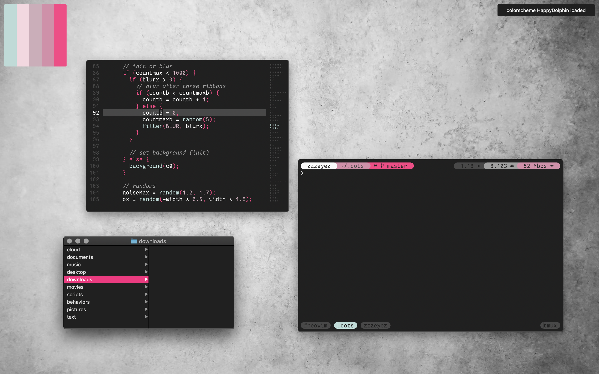

# macos dotfiles

color palettes are generated by [zzzeyez/colorlovers](https://github.com/zzzeyez/colorlovers)

wallpapers are generated by [zzzeyez/new-roses](https://github.com/zzzeyez/new-roses)

font is Operator Mono Nerd Font

## features

- three-finger dragging, tap to click, two-finger tap to right click
- vry fast trackpad and key repeat
- snappy animations + disabled transparency
- load random wallpapers, palettes and menubars via keybinds
- cohesive colors (safari start page, terminals, menubar)

keyboard shortcuts select styles or fetch all my colorschemes and wallpapers from the web. colors are applied to all my apps via `.scss` files, `sassc` and sourcing `.sh` files

## key bindings

### yabai

- (ctrl + shift + enter) create workspace
- (ctrl + shift + delete) destroy workspace
- (ctrl + shift + 1-5) send window to workspace
- (ctrl + space) toggle tiling
- (alt + left/right) switch windows

### terminal programs

- (ctrl + tab) switch `tmux` windows
- (ctrl + enter) opens tmux windows/sessions depending on iTerm2 window status [tmx](https://github.com/zzzeyez/bin)
- (ctrl + w) ^ opposite of that

### wallpapers

- (cmd + 0) random [wallpaper](https://github.com/zzzeyez/bin) for current workspace
- (cmd + shift + 0) random `wallpaper` for all workspaces
- (rcmd + 0-8) `wal` palette solid color as `wallpaper`
- (rcmd + shift + 0) download unsplash.com wallpaper via [new-roses](https://github.com/zzzeyez/new-roses)
- (cmd + shift + d) save `new-roses` wallpaper to ~/pictures/wallpapers

### colorschemes

- (cmd + shift + w) disable [darkmode](https://github.com/zzzeyez/bin) and download + apply light palette via [colorlovers](https://github.com/zzzeyez/colorlovers)
- (cmd + shift + e) enable `darkmode`, download + apply dark `colorlovers` palette
- (cmd + shift + r) load random saved `colorlovers` palette
- (cmd + shift + s) save `colorlovers` palette

### menubar + notifications

- (cmd + h) [toggle](https://github.com/zzzeyez/bin) `xanthia` + `pecan` (also applies `chunkwm` menubar offset via [wal-set](https://github.com/zzzeyez/bin))

## install

**./dots.sh** install everything, update system, backup to external, update this repo

- `./install/brew_packages` list of homebrew packages
- `./install/git_clones` list of github repos
- `./install/macos_settings` list of macos settings
- `./install/save_home` list of files to save if deleting home directory
- `./install/save_library` list of files to save if deleting `~/Library`
- `./install/make_directories` list of folders to recreate if deleting home

## to do + issues i'm experiencing (maybe you can help)

- find way to use `defaults write` to hide the Finder sidebar
- unable to `sudo echo` paths to `/etc/paths.d/paths`
